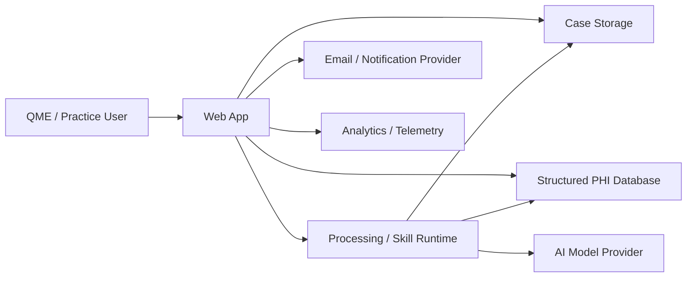

# Current-State Data Flow

Use this template after the interview. Replace placeholders with actual systems and evidence labels.

## Trust boundaries

Document at least:

- customer device ↔ application
- production ↔ non-production
- operator ↔ subprocessors
- case/tenant ↔ other case/tenant
- PHI boundary ↔ PHI-blind external services

## Data inventory

| Component | Vendor / owner | Data handled | PHI? | Region | Contract/BAA status | Evidence level |
|---|---|---|---|---|---|---|
| Web app |  |  |  |  |  |  |
| Source storage |  |  |  |  |  |  |
| Database |  |  |  |  |  |  |
| Model runtime |  |  |  |  |  |  |
| Email |  |  |  |  |  |  |
| Analytics |  |  |  |  |  |  |

## Notes

- Distinguish persistent storage from transient processing.
- Include derived PHI, not only original PDFs.
- Include URLs, logs, analytics, and email when identifiers can leak there.
- If a system is unverified, label it UNKNOWN rather than assuming the intended architecture is real.
